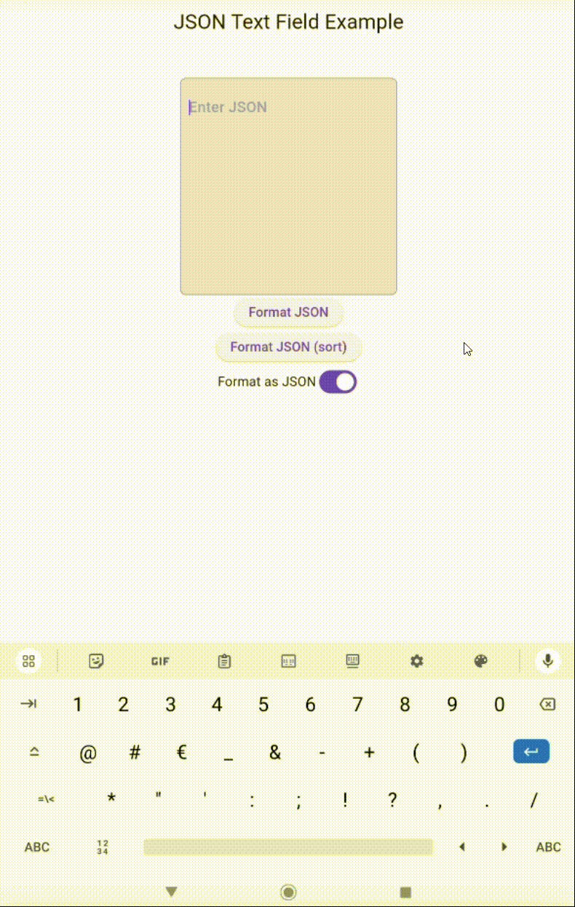
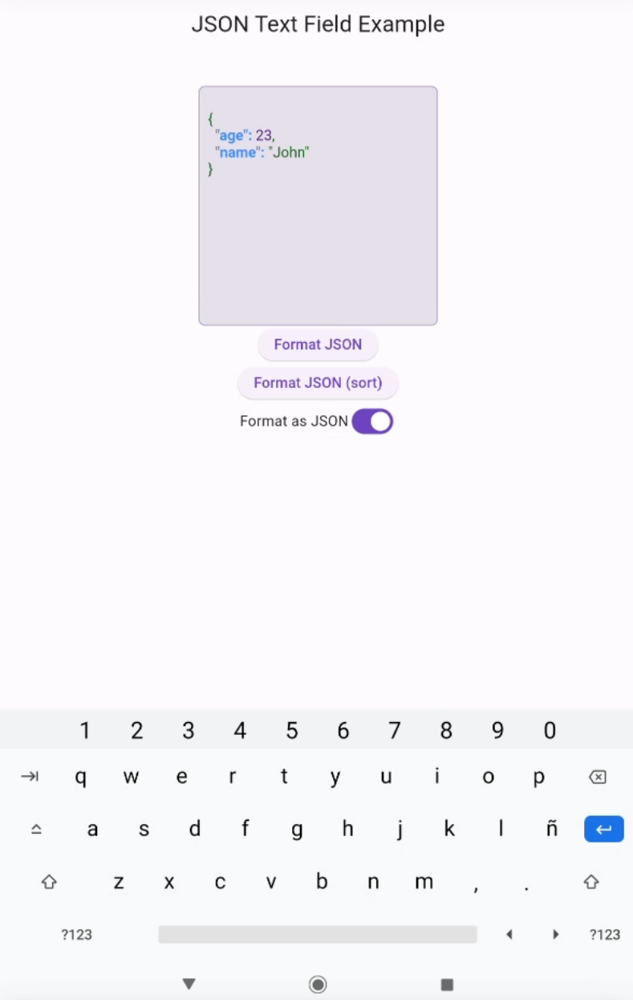
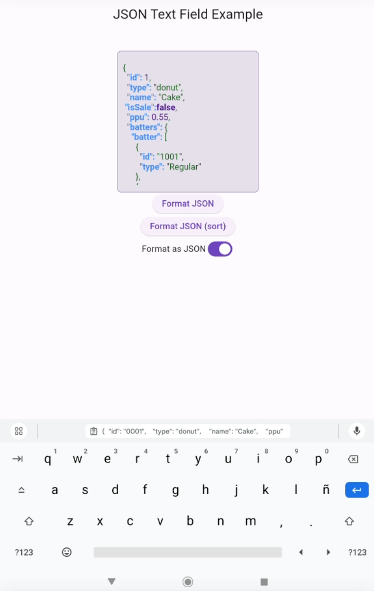

# JSONTextField

Enhance your Flutter apps with `JSONTextField`, a comprehensive package designed for editing JSON files directly within a TextField. This tool integrates seamlessly with Flutter, providing a rich and customizable experience for JSON manipulation.

<center>



</center>


## Key Features

- **Dynamic JSON Value Highlighting**: Effortlessly distinguish between different JSON elements like keys, strings, numbers, booleans, nulls, and special characters through customizable text styles.
- **Validation and Error Display**: Instantly validates JSON strings, highlighting errors for quick fixes.
- **Intuitive JSON Formatting**: Automatically formats JSON strings for better readability, with options for sorting and custom controllers.
- **Seamless Integration**: Easy to incorporate into existing Flutter projects, requiring no additional platform-specific configurations.

## Getting Started

### Adding the Package
Include `json_text_field` in your project by adding it as a dependency in your `pubspec.yaml` file. For detailed instructions, visit [Flutter's plugin guide](https://flutter.io/platform-plugins/).

### Importing the Package
```dart
import 'package:json_text_field/json_text_field.dart';
```

## Basic Usage

Replace the standard `TextField` widget with `JsonTextField` to enable JSON editing capabilities.

```dart
const JsonTextField(),

```

### Customizable Features

`JsonTextField` extends the familiar `TextField` widget, adding unique properties for a tailored JSON editing experience:

- **Custom Highlight Styles**: Personalize the appearance for different JSON elements:
  - `keyHighlightStyle`: Style for JSON keys.
  - `stringHighlightStyle`: Style for string values.
  - `numberHighlightStyle`: Style for number values.
  - `booleanHighlightStyle`: Style for boolean values.
  - `nullHighlightStyle`: Style for null values.
  - `specialCharacterHighlightStyle`: Style for special characters.

### Example Configuration
```dart
JsonTextField(
    keyHighlightStyle: TextStyle(color: Colors.red),
    stringHighlightStyle: TextStyle(color: Colors.green),
    numberHighlightStyle: TextStyle(color: Colors.blue),
    booleanHighlightStyle: TextStyle(color: Colors.yellow),
    nullHighlightStyle: TextStyle(color: Colors.purple),
    specialCharacterHighlightStyle: TextStyle(color: Colors.orange),
),
```

- **Custom Error Styles**: Personalize the appearance for different JSON errors:
  - `errorTextStyle`: Style for JSON errors text.
  - `errorContainerDecoration`: Decoration for JSON errors container.

- **Formatting and Sorting**: Enable or disable automatic formatting and sorting of the JSON string.
    - `isFormatting`: Toggle JSON string formatting.
    - `showErrorMessage`: Show or hide error messages.

    ### Controller Usage

`JsonTextField` utilizes `JsonTextFieldController`, an enhanced version of `TextEditingController`, with an additional method for JSON formatting and sorting.

```dart
final JsonTextFieldController controller = JsonTextFieldController();

Column(
    children: [
        JsonTextField(
            controller: controller,
            isFormatting: true,
            showErrorMessage: false,
        ),
        ElevatedButton(
            onPressed: () => controller.formatJson(sortJson: true),
            child: const Text('Format Json (sort)'),
        ),
    ],
)
```
Explore the complete example in the `example` folder.